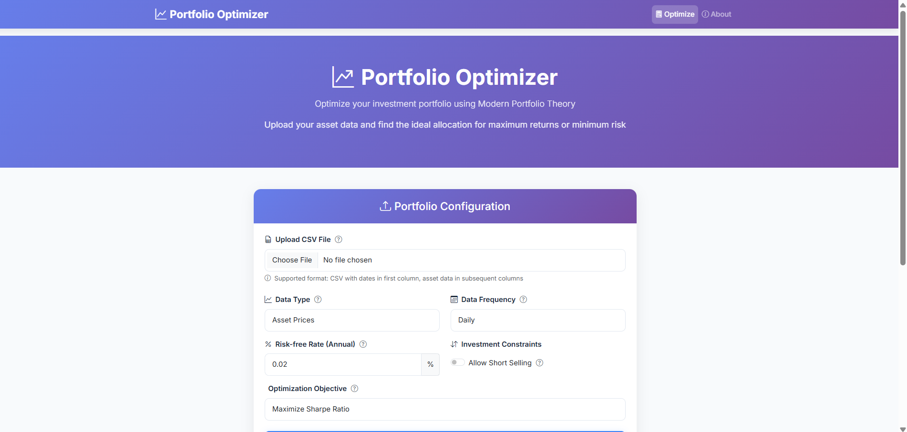
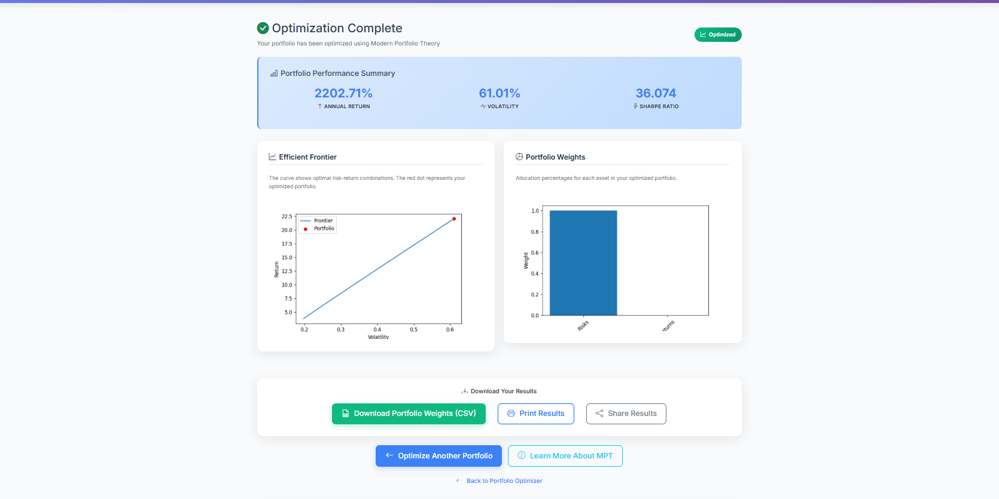
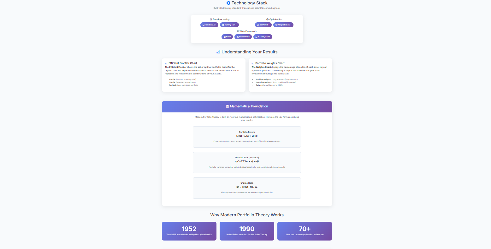

# Stock-Portfolio-optimization-using-Pyportfolio
# 📊 Stock Portfolio Optimizer

A web-based application for **portfolio optimization** using **Modern Portfolio Theory (MPT)** and **PyPortfolioOpt**.  
This tool helps investors and researchers find the **optimal allocation of assets** to maximize returns, minimize risk, or balance both.  

---

## 🚀 Features

- **Upload CSV Data**: Upload asset price/returns data in CSV format (daily, weekly, or monthly).  
- **Multiple Optimization Strategies**:
  - 📈 Maximize Sharpe Ratio  
  - 📉 Minimize Variance  
  - 🎯 Target Return  
- **Efficient Frontier Plot**: Visualize the trade-off between risk and return.  
- **Portfolio Weights Chart**: See asset allocation in your optimized portfolio.  
- **Download Results**: Export optimized portfolio weights in CSV format.  

---

## 🛠 Technology Stack

**Data Processing**  
- Pandas 2.0+  
- NumPy 1.24+  

**Optimization**  
- PyPortfolioOpt 1.5+  
- SciPy 1.10+  
- Matplotlib 3.7+  

**Web Framework**  
- Flask  
- Bootstrap 5  
- HTML/CSS  

---

## 📐 Mathematical Foundation

The optimizer is based on **Modern Portfolio Theory (MPT)**, introduced by **Harry Markowitz (1952)** and awarded the **Nobel Prize (1990)**.  

- **Portfolio Return**:  
  %20=%20%5Csum%20(w_i%20%5Ctimes%20E(R_i)))

- **Portfolio Risk (Variance)**:  
  ))

- **Sharpe Ratio**:  
  %20-%20R_f)%7D%7B%5Csigma_p%7D)

---

## 📷 Screenshots

### Portfolio Configuration


### Optimization Complete


### Understanding Results


### About Page


---

## 📦 Installation & Setup

Clone this repository:

```bash
git clone https://github.com/your-username/stock-portfolio-optimizer.git
cd stock-portfolio-optimizer
```

Create and activate a virtual environment:

```bash
python -m venv venv
source venv/bin/activate   # On Windows: venv\Scripts\activate
```

Install dependencies:

```bash
pip install -r requirements.txt
```

Run the Flask app:

```bash
python app.py
```

Open in browser:  
👉 http://127.0.0.1:5000  

---

## 📂 Project Structure

```
├── app.py                # Flask backend
├── templates/            # HTML templates
├── static/               # CSS, JS, and assets
├── uploads/              # Uploaded CSV files
├── requirements.txt      # Dependencies
└── README.md             # Project documentation
```

---

## 📊 Example Workflow

1. Upload a CSV file containing historical stock price data.  
2. Choose optimization objective (Sharpe Ratio, Variance, or Target Return).  
3. View Efficient Frontier and Portfolio Weights.  
4. Download optimized weights (CSV).  

---

## 🏆 Why Modern Portfolio Theory?

- Developed in **1952** by Harry Markowitz.  
- Awarded the **1990 Nobel Prize** in Economics.  
- Over **70 years of proven application** in finance.  

---

